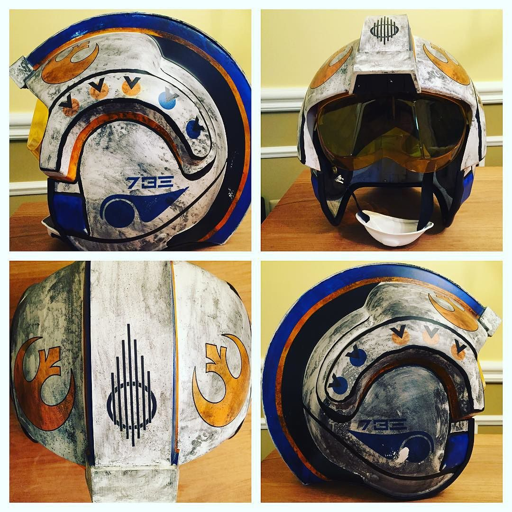

#Making and painting X-wing pilot helmet

[Blank Helmet](https://www.etsy.com/listing/170597554/x-wing-pilot-helmet)

[Building tutorials](https://www.youtube.com/user/TheDarthhair/videos)

[Clear waterslide decal paper for laser printer](http://www.amazon.com/gp/product/B005DFMFB4)

See `/sketch` for files

[Decal application tutorial](https://www.youtube.com/watch?v=-XcBe9T6X7w)

Use "trasnparency" paper type on HP printer (works on CP1525nw)

Final result

